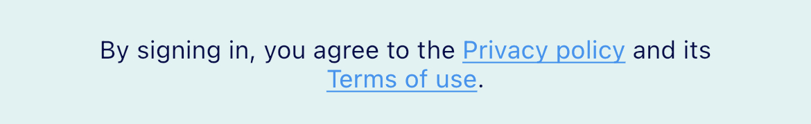

# RichText Widget

Este proyecto ha sido creado para mostrar las capacidades del widget [RichText](https://api.flutter.dev/flutter/widgets/RichText-class.html) como parte de la asignatura **Nuevas tendencias en el desarrollo de aplicaciones móviles** en la [Universidad Oberta de Catalunya](https://www.uoc.edu).

## ¿Para que sirve este widget?

El widget nos sirve para poder personalizar el texto con diversos estilos.



Por ejemplo, en la imagen que podemos ver el texto tiene 2 fragmentos con un color azul y subrayado. Además este widget también nos dejará hacer partes de este interactivas.

## Como se utiliza

El Widget RichText depende de [TextSpan](https://api.flutter.dev/flutter/painting/TextSpan-class.html), este widget tiene como atributos:

- text: Parte del texto que tiene este span.
- children: Puede contener mas objetos que herede de InlineSpan (como por ejemplo otros TextSpan).
- recognizer: Que tiene un [GestureRecognizer](https://api.flutter.dev/flutter/gestures/GestureRecognizer-class.html), donde podemos poner una callback que se ejecutara con la propiedad que definamos como por ejemplo onTap:

```dart
GestureDetector(
    onTap: () {
        Navigator.of(context).pushNamed('/privacy-policy');
    },
    child: Text("Privacy policy"),
);
```

Con este combinando diferentes TextSpans podemos hacer un texto interaccionable como en este ejemplo:

```dart
RichText(
    text: TextSpan(
        text: "Sample text ",
        children: [
            TextSpan(
                text: "Clickable part",
                recognizer: TapGestureRecognizer()
                ..onTap = () {
                    print("Clicked privacy policy");
                },
                style: TextStyle(
                color: Colors.blue,
                decoration: TextDecoration.underline,
                ),
            ),
            TextSpan(
                text: " normal part",
            ),
        ]
    ),
);
```

Aparte de lo mencionado RichText tambien tiene los siguientes atributos:

- locale: Sirve para selecionar los caracteres unicode que se utilizaran para renderizar.
- maxLines: Indica el numero maximo de lineas que puede tener el texto.
- overflow: Indica como se tiene que gestionar cuando superamos el limite de lineas clase [TextOverflow](https://api.flutter.dev/flutter/rendering/TextOverflow-class.html).
- softWrap: Habilita o deshabilita los saltos de linea.
- textAlign: Dirección/Posicion del texto (justify, left, right...).
- textDirection: Texto izquierda a derecha o derecha a izquierda (ltr/rtl).
- textScaleFactor: Valor que escala el tamaño de la fuente siendo 1-100%.

## Ejemplo

Ejemplo testeable en [dartpad](https://dartpad.dev/fb5bc4faa15eee992be29da53f6855c8?)

```dart
RichText(
    text: TextSpan(
        style: const TextStyle(
            color: Colors.black,
            fontWeight: FontWeight.w400,
            fontStyle: FontStyle.normal,
            fontSize: 12.0,
        ),
        text: "By signing in, you agree to the ",
        children: [
            TextSpan(
                text: "Privacy policy",
                recognizer: TapGestureRecognizer()
                ..onTap = () {
                    print("Clicked privacy policy");
                },
                style: TextStyle(
                color: Colors.blue,
                decoration: TextDecoration.underline,
                ),
            ),
            TextSpan(
                text: " and its ",
            ),
            TextSpan(
                text: "Terms of use",
                recognizer: TapGestureRecognizer()
                ..onTap = () {
                    print("Clicked terms of use");
                },
                style: TextStyle(
                color: Colors.blue,
                decoration: TextDecoration.underline,
                ),
            ),
            TextSpan(
                text: ".",
            ),
        ],
    ),
);
```

Este ejemplo corresponde a la imagen inicial.

## Mas información

- [RichText](https://api.flutter.dev/flutter/widgets/RichText-class.html)
- [TextSpan](https://api.flutter.dev/flutter/painting/TextSpan-class.html)
